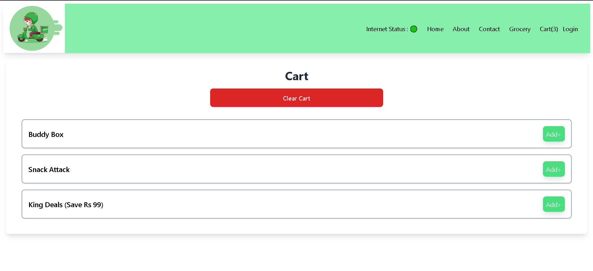
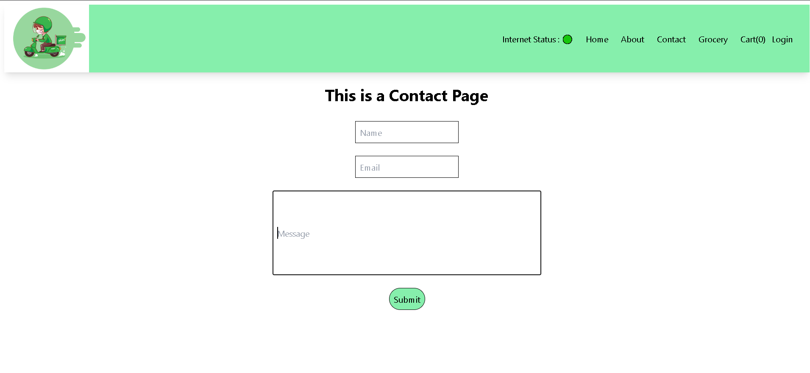
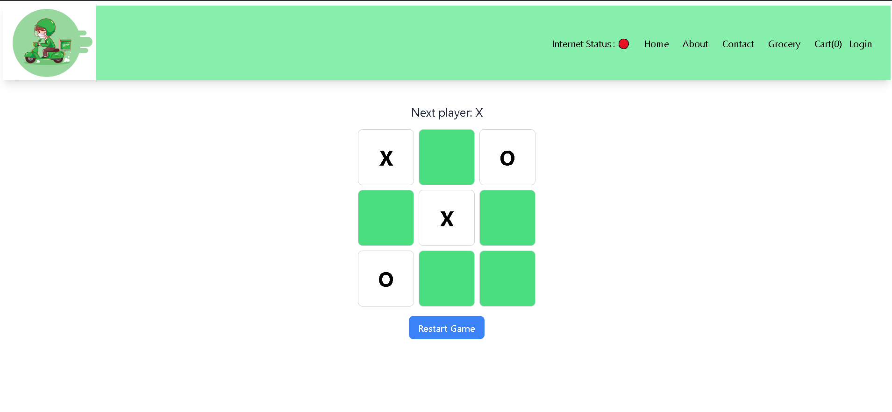
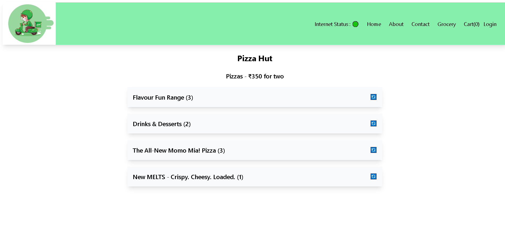

## You can view the live website here : https://foodorderappbytaif.netlify.app/

  ### Main Page  
   
 
 ### Search Functionality  
   

 ### Cart Page  
   

 ### Contact Page  
   

 ### TikTok Game (We can play when the internet is down)  
   

 ### Top Rated Restaurants (Restaurants having rating more than 4.3)
   

 ### Restaurant Menu
  

### Accordion Drop Down List
  

### Clear Cart
  

## CONCEPTS USED
### Functional Components
### React Hooks
### Lazy Loading
### Code Splitting
### React Router DOM
### Redux  

| No. |  | 
|-----|---------------|
| 1   | **###**         
| 2   | **###**        
| 3   | **###**      
| 4   | **###**      
| 5   | **###**     
| 6   | **###**    

